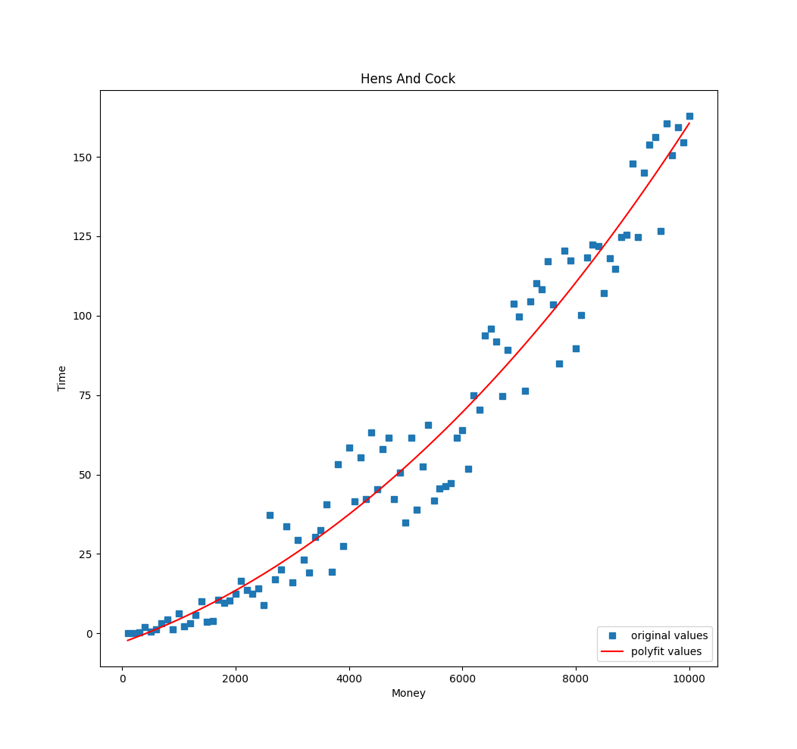

## DataStruct

### Week_1  
[**斐波那契数列**](src/main/java/week_1/wangwei/Fabonacci.java)    

*代码实现*  
```java  
int fabonacci(int n) {
	if(n == 1)
        return 0;
    else if(n == 2)
        return 1;
    else
        return fabonacci(n-1) + fabonacci(n-2);
}
```

[**递归**](src/main/java/week_1/wangwei/Factorial.java)  

*代码实现*  
```java  
int factorial(int n) {
    if(n == 1)
        return 1;
    else
        return n * factorial(n-1);
}
```

[**百钱百鸡问题**](src/main/java/week_1/wangwei/ChickAndHen.java)  
  

*代码实现*  
```java  
int cock_pride = 5; 
int hen_pride = 3;
float chick_pride = 1/3;

//最大可能的公鸡数
int cock_number_top = sum/cock_pride;
//最大可能的母鸡数
int hen_number_top = sum/ hen_pride;
//公鸡数从0开始递增
for(int cock_number=0;cock_number<=cock_number_top;cock_number++) {
    //母鸡数从0开始递增
    for(int hem_number=0;hem_number<=hen_number_top;hem_number++) {
        //小鸡数
        int chick_number = sum - cock_number - hem_number;
        //小鸡数量必须是3的倍数,各种鸡的数量和价格乘积为钱数
        if(chick_number%3==0 && ((cock_number*cock_pride+hem_number* hen_pride +
                chick_number*chick_pride)==sum)){}
    }
}
```

[**冒泡排序与快速排序**](src/main/java/week_1/wangwei/BubbleSort.java)    

*冒泡排序*  
  

*代码实现*  

```java  
for(int i=0; i<=arr.length-1; i++) {
    for(int n=0; n<arr.length-i-1;n++) {
        if(arr[n] > arr[n+1]) {
             int temp = arr[n+1];
             arr[n+1] = arr[n];
             arr[n] = temp;
        }
    }
}
```  

*快速排序*  

  


### Week_2   

**数组模拟乘法**  

[*方法一*](src/main/java/week_2/wangwei/Multiply.java)  
向上抽取的方法较多,反人类代码  

[*方法二* ](src/main/java/week_2/zhenghuanxin/BigNum.java)  
代码逻辑清晰,比较简单,容易理解  

[*方法三* ](src/main/java/week_2/wangwei/Multiply2.java)  
基于方法二的再简化版本,代码比较玄学  

**数组洗牌**    

[*赌神模式1*](src/main/java/week_2/wangwei/PlayingCard/Gambler.java)  

[*荷官模式1*](src/main/java/week_2/wangwei/PlayingCard/Croupier.java)  

[*凡人模式1*](src/main/java/week_2/wangwei/PlayingCard/Ordinary.java)

**跑马灯**  

[*一维数组跑马灯*](src/main/java/week_2/wangwei/marquee/OneDimensional.java)  

[*二维数组跑马灯1*](src/main/java/week_2/wangwei/marquee/TwoDimensional.java)  

[*二维数组跑马灯2*](src/main/java/week_2/wangwei/marquee/TwoDimensional2.java)  

[*三维数组跑马灯*](src/main/java/week_2/wangwei/marquee/ThreeDimensional.java)  

[**第二周作业聚合版**](src/main/java/week_2/wuyanzhen/Week2.java)  

### Week3  

[**第三周作业1**](src/main/java/week_3/wangwei/MyLinkDemo.java)  
Code from wangwei  

[**第三周作业2**](src/main/java/week_3/wuyanzhen/Week3.java)  
Code from wuyanzhen  

[**第三周作业3**](src/main/java/week_3/dqy/Main.java)  
Code from dqy  

### Contributer  

guyuedumingx  
Florence  
zhenghuanxin  
dqy  

### 公开  

欢迎大家提出issus或者给我发微信纠正  
欢迎大家把自己的代码pull resquests  
或者微信给我代码  

### 参与维护  

> 建议您可以先将本项目Fork到您的项目中,再从您的github中clone到本地  
> 避免因上游仓库链接问题`push`失败  

1.clone仓库到本地  
```
git clone git@github.com:guyuedumingx/DataStruct.git
```
> 如果你使用idea,可忽略这一步  

2.将项目导入到`eclipse`或者`idea`  

导入idea的方法：  
```
File -> New -> Project From Version Control -> git@github.com:guyuedumingx/DataStruct.git  > clone   
```  

> 本项目是标准的`maven`项目,你可以按`maven`导入  

3.在`src/main/java/week_n/`下建立自己的包(建议以名字拼音命名) 例如,`wangwei`  
请将您的所有代码都写在您自己的包下  

4.建立`README`索引  

修改`README.md`文件,将您的类链接到标题上,以便浏览  

5.提交`Pull Requests` 给我 

> 或者微信告诉我,我把你添加成贡献者  


### Web  

[十大经典排序动图](https://www.cnblogs.com/onepixel/articles/7674659.html)  
[程序运行过程查看](http://www.pythontutor.com/java.html#mode=edit)  

### Tool  

[Gif制作工具](https://github.com/NickeManarin/ScreenToGif/releases)  
