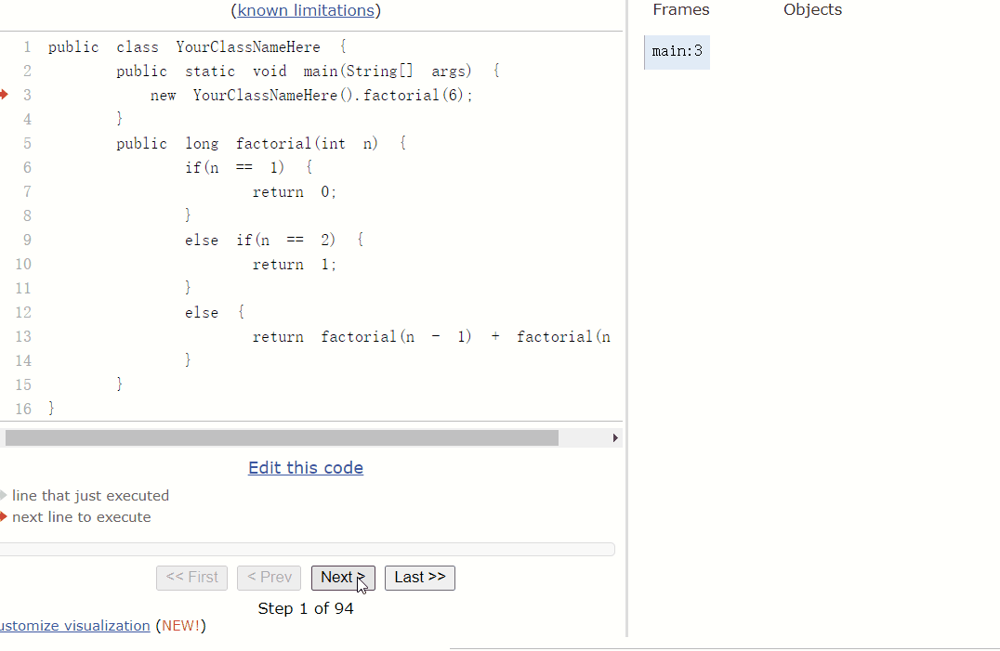
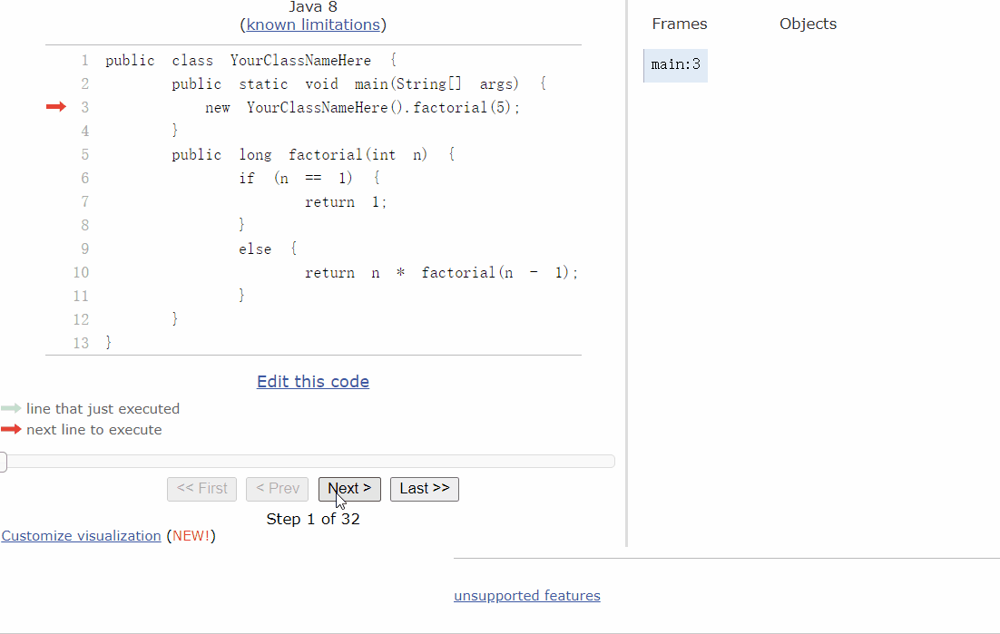

## DataStruct

### Week_1  
[**斐波那契数列**](src/main/java/week_1/Fabonacci.java)    

  

*代码实现*  
```java  
int fabonacci(int n) {
	if(n == 1)
        return 0;
    else if(n == 2)
        return 1;
    else
        return fabonacci(n-1) + fabonacci(n-2);
}
```

[**递归**](src/main/java/week_1/Factorial.java)  

  

*代码实现*  
```java  
int factorial(int n) {
    if(n == 1)
        return 1;
    else
        return n * factorial(n-1);
}
```

[**百钱百鸡问题**](src/main/java/week_1/ChickAndHen.java)  
  

*代码实现*  
```java  
int cock_pride = 5; 
int hen_pride = 3;
float chick_pride = 1/3;

//最大可能的公鸡数
int cock_number_top = sum/cock_pride;
//最大可能的母鸡数
int hen_number_top = sum/ hen_pride;
//公鸡数从0开始递增
for(int cock_number=0;cock_number<=cock_number_top;cock_number++) {
    //母鸡数从0开始递增
    for(int hem_number=0;hem_number<=hen_number_top;hem_number++) {
        //小鸡数
        int chick_number = sum - cock_number - hem_number;
        //小鸡数量必须是3的倍数,各种鸡的数量和价格乘积为钱数
        if(chick_number%3==0 && ((cock_number*cock_pride+hem_number* hen_pride +
                chick_number*chick_pride)==sum)){}
    }
}
```

[**冒泡排序与快速排序**](src/main/java/week_1/BubbleSort.java)    

*冒泡排序*  
  

*代码实现*  

```java  
for(int i=0; i<=arr.length; i++) {
    for(int n=0; n<arr.length-i-1;n++) {
        if(arr[n] > arr[n+1]) {
             int temp = arr[n+1];
             arr[n+1] = arr[n];
             arr[n] = temp;
        }
    }
}
```  

*快速排序*  

  


### Week_2   

[**数组模拟乘法**](src/main/java/week_2/Multiply.java)  

### Contributer  

guyuedumingx  

### Web  

[十大经典排序动图](https://www.cnblogs.com/onepixel/articles/7674659.html)  
[程序运行过程查看](http://www.pythontutor.com/java.html#mode=edit)  

### Tool  

[Gif制作工具](https://github.com/NickeManarin/ScreenToGif/releases)  
